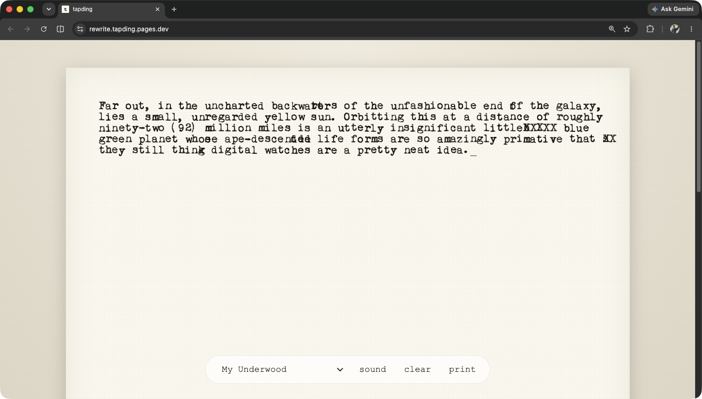

# tapding

A browser typewriter. Type forever, no delete. Once a key is struck the ink is on the paper — your only moves are to overstrike, advance, or carriage-return.

Live at [tapding.pages.dev](https://tapding.pages.dev).



## What it does

- US Letter sheet on a desk, rendered at a 10cpi / 6lpi typewriter grid.
- Backspace moves the carriage left (it never deletes). From column 0 it rolls back into the previous line.
- A margin bell dings near the right edge — its own sound, separate from the carriage return. The carriage hard-locks at column 80; further strikes overstrike the last cell.
- Enter advances a row; new sheets roll in automatically when you hit the bottom.
- Two-color ribbon: flip between black and red ink. Each strike records the color it was typed in, so the page is a faithful record of which letters were red.
- Six typewriter faces, pooled sound effects with a mute toggle, and a print stylesheet that hides everything but the page.
- A glyph-only control pill: ink swatch, font picker, mute, new sheet, print, and a GitHub source link.
- Autosave to localStorage — close the tab, come back, keep typing.
- Each glyph gets a stable per-cell jitter (rotation, ink density, sub-pixel offset) so the page reads as a slightly tired typewriter rather than a laser printer. Once in a while a sheet rolls in crooked — the machine types level rows regardless.
- Keyboard-only and desktop-first: touch visitors get a notice to open tapding on a desktop instead of a broken page.

## Run it

```
npm install
npm run dev
```

`npm test` runs the suite. `npm run build` produces a static bundle under `dist/`.

## Deploy

The build output is a plain static bundle. To deploy to Cloudflare Pages from the CLI:

```
npm run build
npx wrangler pages deploy dist --project-name=tapding
```

Or wire up a Git integration in the Pages dashboard with build command `npm run build` and output directory `dist`.
